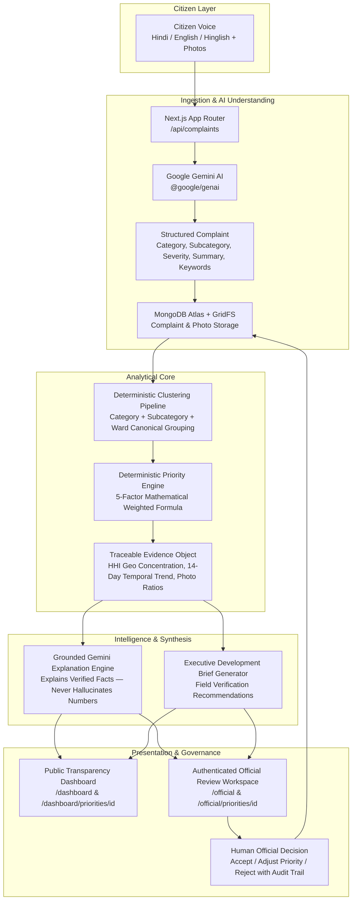

# LokSanket (लोकसंकेत)

> **AI-Powered Constituency Development Intelligence Platform**  
> *Submitted for Code for Communities — Digital Public Infrastructure & Governance*

[](https://nextjs.org/)
[](https://www.typescriptlang.org/)
[](https://tailwindcss.com/)
[](https://ai.google.dev/)
[](https://www.mongodb.com/)
[](https://recharts.org/)

---

## Table of Contents

1. [What is LokSanket?](#what-is-loksanket)
2. [Problem Statement](#problem-statement)
3. [The Solution](#the-solution)
4. [System Architecture](#system-architecture)
5. [Key Features](#key-features)
6. [AI + Deterministic Priority Engine](#ai--deterministic-priority-engine)
7. [Human-in-the-Loop & Responsible AI](#human-in-the-loop--responsible-ai)
8. [Technology Stack](#technology-stack)
9. [Project Structure](#project-structure)
10. [Environment Variables](#environment-variables)
11. [Getting Started & Local Setup](#getting-started--local-setup)
12. [Application Routes & Workspaces](#application-routes--workspaces)
13. [Realistic Demonstration Data](#realistic-demonstration-data)
14. [Hackathon Evaluation & Demo Flow](#hackathon-evaluation--demo-flow)
15. [Deployment Guide](#deployment-guide)
16. [Future Scope](#future-scope)
17. [Credits & Authors](#credits--authors)

---

## What is LokSanket?

**LokSanket** (*लोकसंकेत*, meaning *"Signs / Signals of the People"*) is a civic intelligence and decision-support platform designed for local governance and constituency leadership. It bridges the gap between raw citizen voices across diverse linguistic expressions and actionable, evidence-backed municipal development decisions.

Citizens submit grievances in everyday **Hindi**, **English**, or colloquial **Hinglish** (Romanized Hindi), accompanied by photographic evidence. Rather than creating isolated tickets that get lost in bureaucratic queues, LokSanket transforms these inputs into structured data, groups them into localized issue clusters, calculates a mathematical priority score using a transparent formula, and generates human-auditable executive development briefs.

---

## Problem Statement

Local constituency administrators, elected representatives, and municipal departments face severe operational bottlenecks:

1. **Linguistic Diversity & Unstructured Input**: Citizens communicate grievances informally across colloquial Hindi, English, and Romanized Hinglish. Legacy grievance portals demand rigid drop-down classifications that fail to capture real ground realities.
2. **Noise vs. Signal**: Hundreds of duplicate, fragmented complaints flood helplines. Officials cannot easily distinguish an isolated inconvenience from an escalating systemic breakdown.
3. **Black-Box AI Risks**: Naive LLM implementations hallucinate statistics, fabricate priorities, or invent non-existent localities, making public officials hesitant to rely on generative AI for budget allocations.
4. **Lack of Evidence-Backed Prioritization**: Decisions often depend on who shouts loudest or who has political proximity, rather than objective metrics such as affected population volume, hazard severity, recent trend spikes, and geographical clustering.
5. **Absence of Transparent Decision Support**: Citizens lack visibility into why certain civic projects are prioritized, while officials lack structured briefings explaining ground urgency.

---

## The Solution

LokSanket resolves these challenges through a strict **Separation of Responsibilities**:

* **Google Gemini** provides semantic understanding, multi-lingual normalization, structured extraction, evidence-based narrative explanations, and executive synthesis. **Gemini does NOT compute numerical priorities or invent statistics.**
* A **Deterministic Priority Engine** computes verifiable, reproducible priority scores (0–100) using a 5-factor mathematical formula grounded in hard database metrics.
* A **Human-in-the-Loop Governance Workflow** keeps final decisions in the hands of elected representatives and municipal officers (Accept, Adjust, or Reject), providing complete audit trails.
* A **Dual-Workspace Architecture** provides public transparency for citizens while reserving audit controls for authorized administrators.

---

## System Architecture

### Implemented End-to-End Flow



### Flow Breakdown

1. **Citizen Submission**: A citizen submits a grievance via `/report` using natural colloquial language, selecting or typing in their ward/locality, and attaching up to 5 photos.
2. **AI Structured Extraction**: Google Gemini parses the grievance into structured JSON: primary category, subcategory, severity (`low`, `medium`, `high`, `critical`), English summary, detected language, affected demographic groups, and normalized problem text.
3. **GridFS Storage**: Uploaded photo files undergo strict MIME-type and size checks, and are streamed into MongoDB GridFS buckets for high-fidelity retrieval.
4. **Issue Clustering**: The system groups individual complaints strictly by `Category + Subcategory + Ward` into canonical `IssueCluster` entities. Cross-category mixing is programmatically prevented.
5. **Deterministic Priority Scoring**: The engine evaluates each cluster against 5 objective factors and assigns an immutable 0–100 score and priority tier (`High`, `Medium`, `Low`).
6. **Traceable Evidence Generation**: An evidence payload is constructed directly from MongoDB records: exact report counts, 14-day temporal trend percentage, photo counts, severity ratios, and Herfindahl-Hirschman Index (HHI) for geographic concentration.
7. **Gemini Grounded Explanation**: Gemini receives the verified evidence payload and explains *why* the issue was flagged, strictly restricted to the numbers in the payload.
8. **Public & Official Delivery**: Insights are rendered through responsive charts and cards. Officials review recommendations and log human decisions with audit notes.

---

## Key Features

### 1. Multilingual Civic Intake (Hindi / Hinglish / English)
* Natural language processing handles informal Romanized Hindi (*"Ward 17 Gandhi Nagar road par itne bade potholes hain ki do bike slip ho gayi"*), Devanagari Hindi (*"वार्ड 14 में पिछले कई दिनों से नलों में मटमैला और बदबूदार पानी आ रहा है"*), and formal English.
* Includes one-click quick scenario chips on `/report` for immediate evaluator testing.

### 2. Multi-Photo Evidence Attachment via MongoDB GridFS
* Citizens can drag-and-drop or upload up to 5 photos per grievance (JPEG, PNG, WebP up to 5 MB each).
* Photo files are validated for size and MIME integrity, stored natively in MongoDB GridFS, and served via `/api/photos/[...slug]`.

### 3. Canonical Issue Clustering (Zero Category Cross-Contamination)
* Normalizes wards, localities, and civic categories.
* Groups complaints using a strict composite key: `Category:::Subcategory:::Ward`. Road issues never contaminate water issues, and adjacent wards remain cleanly isolated.

### 4. Deterministic Priority Engine (30/25/20/15/10 Formula)
* Calculates priority scores with mathematical precision. Every score can be audited by comparing database counts against the open formula.

### 5. Grounded Gemini Explanations & Field Briefs
* Gemini generates structured narrative explanations and constituency briefs strictly using the verified evidence object.
* System prompts explicitly forbid inventing statistics, altering counts, or using commanding directives (*"The government must immediately fix this"*).
* Suggests concrete **on-ground field verification steps** for municipal junior engineers before public funds are spent.

### 6. Dual-Workspace Governance
* **Public Transparency Dashboard (`/dashboard`)**: Open civic dashboard displaying constituency KPIs, category distribution bar charts, 30-day temporal trend charts, top-ranked priority clusters, and traceable evidence.
* **Official Review Workspace (`/official`)**: Gated interface for municipal commissioners, MLAs, and ward corporators to audit AI scores, adjust priority classifications, record rationale, and generate executive briefs.

### 7. Human-in-the-Loop Decision Recording
* Officials can **Accept**, **Adjust** (e.g. modify High to Medium with justification), or **Reject** a flagged cluster.
* All reviews persist with reviewer timestamps, old vs. new priority states, and notes in the `Review` collection.

### 8. Full Bilingual UI Localization
* Instant English / Hindi toggle (`LanguageContext`) across all public navigation, landing page sections, grievance submission forms, and dashboard views.

---

## AI + Deterministic Priority Engine

### The Core Architectural Principle

$$\text{Gemini Understands \& Explains} \quad \Big\Vert \quad \text{Deterministic Engine Calculates}$$

* **Gemini's Role**: Linguistic comprehension, categorization, severity assessment of descriptive text, translation, synthesis, and explanatory narrative generation.
* **Engine's Role**: Mathematical counting, temporal comparison, geographic concentration modeling, weighted scoring, and priority tier classification.
* **The Rule**: Gemini **never** calculates or alters numerical priority scores, and **never** invents statistics.

### The 5-Factor Priority Formula

The priority score ($S \in [0, 100]$) is computed as:

$$\text{Priority Score} = 0.30 \cdot D + 0.25 \cdot V + 0.20 \cdot T + 0.15 \cdot G + 0.10 \cdot E$$

| Factor | Weight | Metric & Mathematical Basis | Implementation Details |
| :--- | :---: | :--- | :--- |
| **Demand Volume ($D$)** | **30%** | Cohort-relative report count: $\min\left(100, \frac{\text{ReportCount}}{\text{MaxCohortVolume}} \times 100\right)$ | Scales linearly relative to the highest-volume cluster in the constituency dataset. |
| **Severity ($V$)** | **25%** | Weighted points mapping: Critical = 100, High = 75, Medium = 50, Low = 25 | $\frac{25 \cdot L + 50 \cdot M + 75 \cdot H + 100 \cdot C}{\text{Total Reports}}$ |
| **Recent Trend ($T$)** | **20%** | 14-day temporal surge comparison: Recent (0–14 days) vs Previous (15–28 days) | Baseline 50 pts (neutral/stable). Positive surge (+1% to +100%) scales 50 $\to$ 100. Declining trend scales 50 $\to$ 0. Emerging spikes scale 60 $\to$ 100. |
| **Geographic Concentration ($G$)** | **15%** | Herfindahl-Hirschman Index (HHI) of locality shares: $\text{HHI} = \sum s_i^2$ | $\min(100, \sqrt{\text{HHI}} \times 100)$. A single hyper-concentrated hotspot = 100; widely dispersed reports = $<30$. |
| **Evidence Strength ($E$)** | **10%** | Multi-factor evidence credibility composite | Photo ratio (up to 40 pts) + Locality corroboration (up to 25 pts) + High/Crit ratio (up to 20 pts) + Log volume (up to 15 pts). |

### Priority Classification Thresholds

* **High Priority**: Score **80.0 – 100.0** (Immediate civic urgency, acute danger, or massive public demand)
* **Medium Priority**: Score **60.0 – 79.9** (Significant service disruption requiring scheduled intervention)
* **Low Priority**: Score **0.0 – 59.9** (Localized or routine maintenance issues)

---

## Human-in-the-Loop & Responsible AI

LokSanket is strictly a **decision-support platform**, not an automated decider for municipal resource allocation. It adheres to responsible AI principles:

```
[ AI Recommendation ] ──> High Priority (Score: 85.4)
                                    │
                                    ▼
[ Human Official Review ] ──> "Adjusted to Medium"
                              Reason: "PWD already issued repair tender for Sector Road."
                                    │
                                    ▼
[ Transparent Outcome ] ──> AI Recommendation: High (85.4)
                            Official Decision: Adjusted to Medium (Reviewed by Commissioner)
```

1. **Non-Overriding AI**: An official's adjustment modifies the operational decision status without overwriting the underlying AI score or raw citizen data.
2. **Auditability**: Every review records the official's decision (`accept`, `adjust`, `reject`), custom note, timestamp, and optional adjusted level in MongoDB.
3. **Data Provenance & Disclaimers**: All dashboard cards, briefs, and cluster views display prominent notices indicating the dataset nature and reminding officials that field inspection is required before financial commitment.
4. **Colloquial Safeguards**: Prompts explicitly instruct Gemini not to hallucinate non-existent government programs, departments, or private citizens' names.

---

## Technology Stack

| Layer | Technologies | Purpose / Notes |
| :--- | :--- | :--- |
| **Framework** | **Next.js 16.3 (App Router)** | Modern React server components, route handlers, and server actions |
| **Language** | **TypeScript 5.0** | Full type safety across models, APIs, and AI schemas |
| **Styling** | **Tailwind CSS v4** | Clean, accessible design system with responsive layouts |
| **Icons** | **Lucide React** | Consistent civic UI iconography |
| **Database** | **MongoDB Atlas + Mongoose 9** | Flexible document storage with schema indexing |
| **Binary Storage**| **MongoDB GridFS** | Native streaming storage for citizen evidence photos |
| **AI / LLM** | **Google Gemini (`@google/genai` v2.24)** | Structured grievance extraction, explanations, and briefs (`gemini-3.5-flash-lite`, `gemini-3.8-flash`) |
| **Visualizations**| **Recharts v3** | Responsive category bar charts and 30-day temporal trend area charts |
| **Scripting / CLI**| **tsx v4** | Fast TypeScript runner for seeding, clustering, priority, and unit test suites |

*(Note: Map visualizations use localized tabular and HHI distribution models; Leaflet is not utilized to maintain zero-bundle overhead and fast page-loads.)*

---

## Project Structure

```
loksanket/
├── app/
│   ├── api/
│   │   ├── brief/route.ts                # Gemini Development Brief generation endpoint
│   │   ├── complaints/route.ts           # Grievance submission (JSON / Multipart + GridFS)
│   │   ├── dashboard/route.ts            # Constituency KPIs, category breakdown, timeline
│   │   ├── official/
│   │   │   ├── login/route.ts            # Session token issue with OFFICIAL_DEMO_CODE
│   │   │   ├── logout/route.ts           # Official session invalidation
│   │   │   └── status/route.ts           # Authentication verification check
│   │   ├── photos/[...slug]/route.ts     # GridFS photo streaming endpoint
│   │   └── priorities/
│   │       ├── route.ts                  # Filtered cluster list retrieval
│   │       ├── rebuild/route.ts          # On-demand clustering & priority recalculation
│   │       └── [id]/
│   │           ├── route.ts              # Detailed cluster evidence & breakdown
│   │           ├── explain/route.ts      # Grounded Gemini explanation generation
│   │           └── review/route.ts       # Human official review submission
│   ├── dashboard/
│   │   ├── briefs/page.tsx               # Public Development Brief view
│   │   ├── priorities/[id]/page.tsx      # Public cluster detail & explanation view
│   │   └── page.tsx                      # Public Constituency Transparency Dashboard
│   ├── official/
│   │   ├── access/page.tsx               # Demo access gate for hackathon evaluators
│   │   ├── briefs/page.tsx               # Official Executive Development Brief workspace
│   │   ├── priorities/[id]/page.tsx      # Official Human Review workspace
│   │   └── page.tsx                      # Official Review Dashboard with Rebuild action
│   ├── report/page.tsx                   # Citizen Grievance Submission Portal
│   ├── globals.css                       # Tailwind CSS v4 styling rules
│   ├── layout.tsx                        # Root layout with LanguageProvider
│   └── page.tsx                          # Public Landing Page & Interactive Showcase
├── components/
│   ├── briefs/
│   │   └── DevelopmentBriefView.tsx      # Executive brief renderer with field checks
│   ├── dashboard/
│   │   └── ConstituencyDashboard.tsx     # Recharts visualizations, KPI cards, cluster table
│   ├── layout/
│   │   ├── Footer.tsx                    # Civic portal footer with links & disclaimers
│   │   └── Navbar.tsx                    # Bilingual nav, mode indicators, logout controls
│   └── priorities/
│       └── PriorityDetailView.tsx        # 5-factor mathematical audit & review form
├── context/
│   └── LanguageContext.tsx               # Bilingual (English/Hindi) state provider
├── lib/
│   ├── aggregation.ts                    # Deterministic MongoDB aggregation pipelines
│   ├── auth.ts                           # Demo session cookies & token validation
│   ├── clustering.ts                     # Category + Subcategory + Ward canonical grouping
│   ├── db.ts                             # Cached Mongoose connection handler
│   ├── gemini.ts                         # Google GenAI extraction, explanation & brief prompts
│   ├── i18n.ts                           # Comprehensive English/Hindi translations & formatters
│   ├── photo-validation.ts               # MIME type, size (5 MB), and count limits (max 5)
│   ├── priority.ts                       # 5-factor deterministic priority scoring engine
│   └── storage.ts                        # GridFS bucket upload & download streams
├── models/
│   ├── Complaint.ts                      # Citizen grievance schema with structured AI fields
│   ├── IssueCluster.ts                   # Clustered issue schema with traceable evidence
│   └── Review.ts                         # Official human review decisions & audit trail
├── scripts/
│   ├── run-clustering.ts                 # CLI runner to group complaints into clusters
│   ├── run-priority.ts                   # CLI runner to calculate & persist priority scores
│   ├── seed.ts                           # Deterministic PRNG seed script (600+ complaints)
│   └── test-priority.ts                  # Edge-case unit test suite (0 reports, surges, ties)
├── middleware.ts                         # Edge route protection for /official/*
├── package.json                          # Dependencies and npm scripts
└── .env.example                          # Environment variable template
```

---

## Environment Variables

All environment configuration must be stored in `.env.local` (for local development) or injected into your cloud hosting dashboard (e.g. Vercel).

> [!WARNING]
> **Never commit `.env.local` to version control.** Ensure `.env.local` is present in your `.gitignore`.

### Required Variables

Create a `.env.local` file in the project root:

```env
# =============================================================================
# Google Gemini API Key (Obtain from https://aistudio.google.com/)
# =============================================================================
GEMINI_API_KEY=your_gemini_api_key_here

# =============================================================================
# MongoDB Atlas Connection String
# =============================================================================
MONGODB_URI=mongodb+srv://<username>:<password>@<cluster-url>/?retryWrites=true&w=majority

# =============================================================================
# Optional: Preferred Gemini Model
# Defaults to gemini-3.5-flash-lite with gemini-3.8-flash fallback
# =============================================================================
# GEMINI_MODEL=gemini-3.8-flash

# =============================================================================
# Official Review Demo Access (Hackathon Access Gate)
# Default demo code is: loksanket2026
# =============================================================================
OFFICIAL_DEMO_CODE=loksanket2026
OFFICIAL_SESSION_TOKEN=ls_official_session_demo_secret_token_2026
```

---

## Getting Started & Local Setup

### Prerequisites

* **Node.js**: `v20.x` or later (supports native `process.loadEnvFile`)
* **npm**: `v10.x` or later
* **MongoDB**: A free MongoDB Atlas cluster or local MongoDB instance (v6.0+)
* **Google Gemini API Key**: From [Google AI Studio](https://aistudio.google.com/)

### Step-by-Step Installation

1. **Clone the repository**:
   ```bash
   git clone https://github.com/amannegi001/lokSanket.git
   cd loksanket
   ```

2. **Install project dependencies**:
   ```bash
   npm install
   ```

3. **Configure environment variables**:
   ```bash
   cp .env.example .env.local
   # Open .env.local and insert your real GEMINI_API_KEY and MONGODB_URI
   ```

4. **Seed the database with Realistic Demonstration Data**:
   ```bash
   npm run seed
   ```
   *This synthesizes over 600 realistic citizen complaints across 10 civic categories and 10 wards with a deterministic Mulberry32 PRNG (seed 42).*

5. **Execute the issue clustering pipeline**:
   ```bash
   npm run cluster
   ```
   *This groups complaints into canonical clusters, tags complaint IDs, and computes baseline evidence.*

6. **Execute the deterministic priority engine**:
   ```bash
   npm run priority
   ```
   *This runs the 5-factor mathematical formula across all clusters and persists scores.*

7. **Run the edge-case unit test suite**:
   ```bash
   npm run test:priority
   ```
   *Validates edge cases: zero reports, single reports, 100% surge profiles, tied localities, and score bounds.*

8. **Start the local Next.js development server**:
   ```bash
   npm run dev
   ```
   Open [http://localhost:3000](http://localhost:3000) in your browser.

---

## Application Routes & Workspaces

### Public Routes (Open Civic Access)

| Route | Description |
| :--- | :--- |
| `/` | **Landing Page & Showcase**: Overview, architecture, interactive sample cluster preview, and bilingual toggle. |
| `/report` | **Citizen Grievance Portal**: Multilingual complaint submission in Hindi, English, or Hinglish with photo upload. |
| `/dashboard` | **Constituency Transparency Dashboard**: Overall KPIs, category distribution bar chart, 30-day temporal trend chart, and priority list. |
| `/dashboard/priorities/[id]` | **Priority Detail View**: Full mathematical breakdown of the 5 factors, locality list, sample grievances, and grounded Gemini explanation. |
| `/dashboard/briefs` | **Public Development Brief**: View the latest executive development brief synthesized from constituency evidence. |

### Official Workspace Routes (Protected by Middleware & Demo Gate)

Access requires authentication via `/official/access` using the demo code `loksanket2026`.

| Route | Description |
| :--- | :--- |
| `/official/access` | **Demo Access Gate**: Password screen for hackathon evaluators. |
| `/official` | **Official Review Dashboard**: Constituency overview with an active **"Rebuild Pipeline"** trigger. |
| `/official/priorities/[id]` | **Official Human Review Workspace**: Evaluate AI scores, record review decisions (**Accept / Adjust / Reject**), enter audit notes, and save. |
| `/official/briefs` | **Executive Brief Workspace**: On-demand generator that calls Gemini to draft a structured constituency brief with engineering field checks. |

---

## Realistic Demonstration Data

To enable immediate, zero-friction hackathon evaluation without waiting for hundreds of manual grievance submissions, LokSanket includes an intentional, reproducible **Realistic Demonstration Dataset**.

* **Explicitly Labeled**: All records and API responses are marked with `datasetLabel: "Realistic Demonstration Data"` to distinguish synthetic demonstration records from genuine live user submissions.
* **Deterministic Generation**: Generated via Mulberry32 PRNG (fixed seed 42) in `scripts/seed.ts`. Re-running the seed script produces identical, audit-grade data every time.
* **Anchor Demonstration Story — Ward 17 Road Infrastructure**:
  * **Category**: Road Infrastructure (*Potholes / Road Damage*)
  * **Ward**: Ward 17 (Gandhi Nagar, Patel Chowk, Station Road, Subhash Marg, College Road)
  * **Volume**: Exactly **137 reports**
  * **Photo Evidences**: **18 submissions**
  * **High / Critical Severity**: **120 reports** (95 High, 25 Critical)
  * **Temporal Profile**: Surging trend (**+159%** in the recent 14-day window)
  * **Priority Score**: Consistently ranks at the top with a **High Priority score (>85/100)**

---

## Hackathon Evaluation & Demo Flow

Evaluators can follow this step-by-step walkthrough to test the end-to-end working system:

```
[ Step 1: Submit Grievance ] ──> /report (Try Hinglish, Hindi, or English + Photo)
            │
            ▼
[ Step 2: Instant Extraction ] ──> Observe Gemini's real-time structured breakdown
            │
            ▼
[ Step 3: Public Transparency ] ──> /dashboard (Explore KPIs, Recharts graphs, Ward 17 anchor)
            │
            ▼
[ Step 4: Mathematical Audit ] ──> /dashboard/priorities/[id] (Inspect 5-factor formula)
            │
            ▼
[ Step 5: Grounded Explanation ] ─> Click "Generate Grounded AI Explanation"
            │
            ▼
[ Step 6: Official Login ] ─────> /official/access (Enter code: loksanket2026)
            │
            ▼
[ Step 7: Human Review ] ───────> /official/priorities/[id] (Accept, Adjust, or Reject)
            │
            ▼
[ Step 8: Development Brief ] ──> /official/briefs (Generate executive constituency brief)
```

### Detailed Walkthrough

1. **Submit a New Grievance (`/report`)**:
   * Click one of the quick scenario chips (e.g. *Hinglish (Road & Rain)*).
   * Notice how Gemini extracts the category (*Road Infrastructure*), subcategory (*Potholes / Road Damage*), severity (*high*), affected groups (*school students, commuters*), and normalized text.
   * Attach an evidence photo and click **Submit Grievance**.
2. **Explore Public Intelligence (`/dashboard`)**:
   * Navigate to `/dashboard`.
   * View the total report count, category distribution chart, and 30-day temporal trend chart.
   * Filter clusters by Priority Level (*High / Medium / Low*) or Category (*Road Infrastructure, Water Supply, etc.*).
3. **Inspect the Anchor Priority Cluster**:
   * Click on **"Road Damage & Potholes — Ward 17"**.
   * Note the transparent mathematical breakdown:
     * Demand Volume (30%)
     * Severity Score (25%)
     * Recent Trend (+159% surge, 20%)
     * Geographic Concentration (HHI, 15%)
     * Evidence Strength (photos + high severity ratio, 10%)
   * Click **"Generate Grounded AI Explanation"** to see Gemini articulate *why* it was flagged using only these numbers.
4. **Enter Official Review Mode (`/official/access`)**:
   * Click **"Official Review"** in the top navigation bar.
   * Enter the evaluator code: `loksanket2026`.
   * Open the Ward 17 cluster in official mode.
   * In the **Official Human Review** card, select **Adjust Priority**, change it to **Medium**, enter a note (*"Emergency patching scheduled under PWD Quick Response Fund"*), and click **Save Review Decision**.
   * Observe how the system updates the review audit state while preserving the original deterministic score.
5. **Generate an Executive Development Brief (`/official/briefs`)**:
   * Navigate to **Development Brief** in the official navigation bar.
   * Click **Generate Constituency Brief**.
   * Watch Gemini synthesize the constituency evidence into an executive briefing complete with recommended on-ground technical verification checks for municipal junior engineers.

---

## Deployment Guide

### Deploying to Vercel

LokSanket is built on the Next.js App Router and deploys seamlessly to Vercel:

1. Push your repository to GitHub.
2. Import the repository into the [Vercel Dashboard](https://vercel.com/new).
3. In **Project Settings $\to$ Environment Variables**, configure:
   * `GEMINI_API_KEY`: Your Google AI Studio API key.
   * `MONGODB_URI`: Your MongoDB Atlas connection URI.
   * `OFFICIAL_DEMO_CODE`: `loksanket2026` (or your chosen passcode).
   * `OFFICIAL_SESSION_TOKEN`: Any secure random string.
   * `GEMINI_MODEL`: `gemini-3.8-flash` (optional).
4. Run the database seed and priority pipeline against your production MongoDB cluster:
   ```bash
   # From your local terminal pointing to production MongoDB:
   npm run seed
   npm run cluster
   npm run priority
   ```
5. Deploy! Vercel will build the Next.js production bundle using `next build`.

---

## Future Scope

* **Interactive GIS Ward Mapping**: Integration of vector shapefiles and OpenStreetMap boundaries for visual polygon heatmaps of infrastructure hazards.
* **Voice & WhatsApp Civic Helplines**: Integration with speech-to-text models for IVR phone-in citizen reporting and automated WhatsApp chatbot intake.
* **Municipal Work-Order Integration**: Direct two-way API webhooks to municipal ERPs and grievance redressal portals (such as CP-GRAMS or CM Helplines) to track ground resolution from budget sanction to completion.
* **Citizen Feedback Loop**: Automatic SMS/WhatsApp alerts notifying citizens when their clustered grievance has been reviewed, sanctioned, or resolved by their local representative.

---

## Credits & Authors

* **Developer**: Aman Negi ([@amannegi001](https://github.com/amannegi001))
* **Initiative**: Submitted for **Code for Communities — Digital Public Infrastructure & Governance**
* **AI Technology**: Powered by **Google Gemini** (`@google/genai`)
* **Design & Concept**: Built to empower accountable, data-driven local representation across Indian constituencies.
